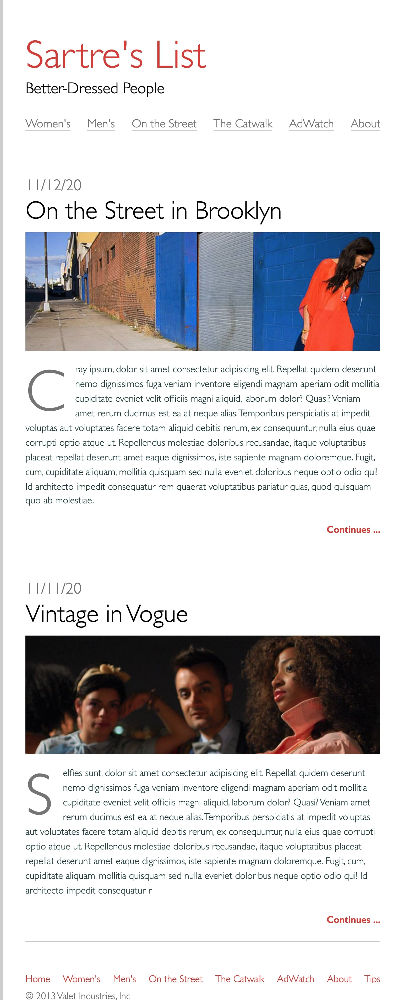
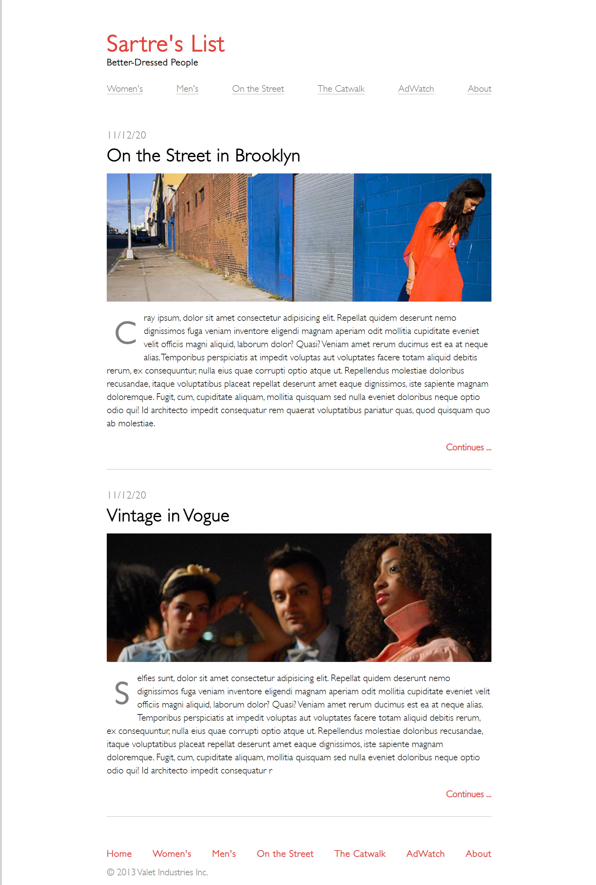

# Sartre's List - Fashion Blog

This project is developed as part of the Per Scholas Software Engineering Training program. It is a mockup design meant to showcase front-end development skills. The project is available in two versions: HTML & CSS, and React. The website is a fashion blog that features a list of articles, images, and, navigation links.

## Live Site Links

- [HTML & CSS Version](https://html-css-fashion-blog.vercel.app/)
- [React Version](https://react-fashion-blog.vercel.app/)

## Reference Design

## Screenshot

